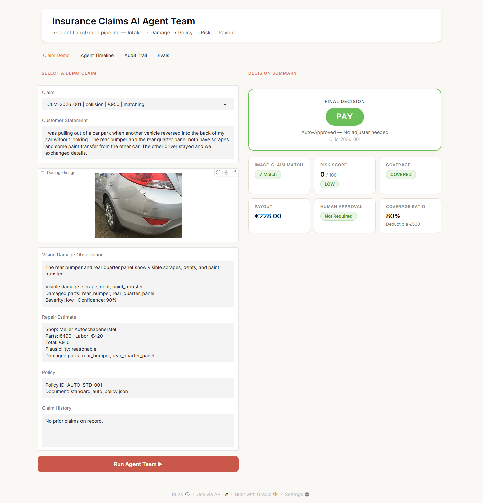
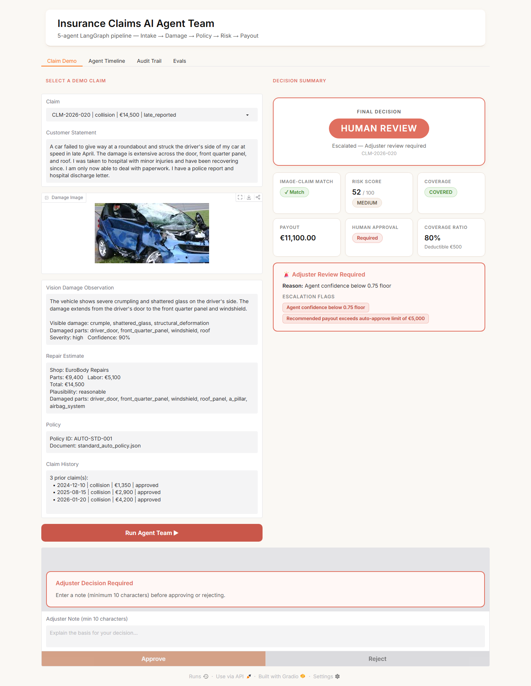
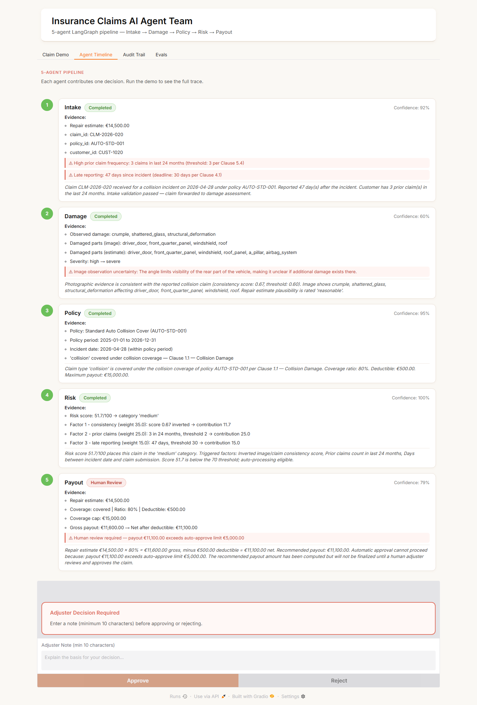
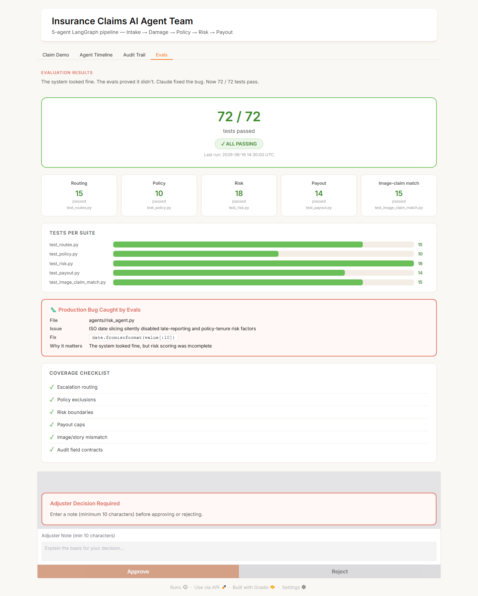
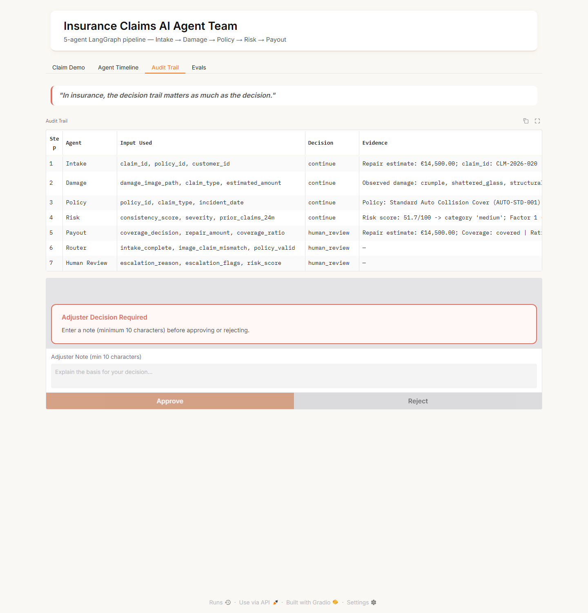
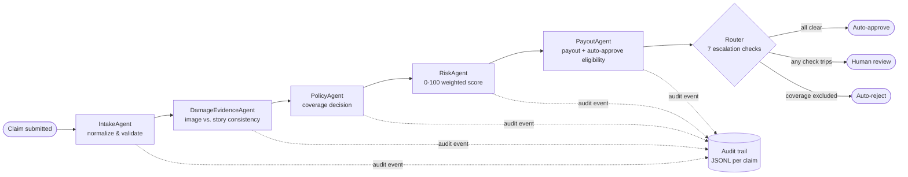

# ClaimSight — Insurance Claims AI Agent Team

A production-style five-agent LangGraph pipeline that processes auto insurance claims end-to-end. Structured claim inputs flow through five sequential agents and produce a decision packet: either auto-approving clean claims or escalating ambiguous, mismatched, or high-risk claims to a human adjuster.

Built to show what an agentic workflow looks like when it has to survive contact with a real decision process: every agent-to-agent handoff is a typed Pydantic model (never a raw string), every decision is written to an audit trail, and seven independent escalation checks gate anything ambiguous into human review instead of auto-approving it.

## Why this project

Most agent demos stop at "the LLM produced a plausible-looking answer." Insurance claims can't work that way — a wrong auto-approval is a real payout. This project explores the patterns that make an LLM pipeline safe to put in front of that kind of decision:

- **Structured handoffs, not prose.** No agent passes free text to the next one; everything downstream reads typed fields (see `core/claim_state.py`).
- **Confidence and evidence on every output.** Each agent reports a `confidence` score and the `evidence` that drove its decision, so low-confidence outputs can be caught mechanically instead of trusted blindly.
- **Human-in-the-loop by design, not by exception.** The router (`core/routing.py`) checks seven independent conditions — risk score, confidence floor, image/claim mismatch, missing or invalid policy, coverage exclusion, payout cap, risk category — and routes to a human reviewer the moment any one of them trips.
- **A vision model as a fact-checker.** `DamageEvidenceAgent` scores how consistent the submitted photo is with the claimant's story, and a low score is itself an escalation trigger — a lightweight fraud-detection signal.

See [`_bmad-output/planning-artifacts/prd.md`](_bmad-output/planning-artifacts/prd.md) for the product brief this was built against.

## Screenshots

| Claim Demo — auto-approved | Claim Demo — escalated |
|---|---|
|  |  |

| Agent Timeline — per-agent confidence & evidence | Evals — 72/72 passing, real bug caught |
|---|---|
|  |  |

Full structured audit trail per claim: 

## Quick Start

```bash
cp .env.example .env          # add OPENAI_API_KEY (not required for the demo path below)
uv venv && uv sync
uv run python main.py         # run the 3 demo scenarios end-to-end, print decisions
uv run python ui/app.py       # launch the Gradio UI at http://127.0.0.1:7860
uv run pytest evals/          # run all 72 evaluation tests
```

The demo runs fully offline against fixtures in `data/` — including pre-computed vision observations in `data/image_observations.json` — so it needs no live API key. See [Vision model integration](#vision-model-integration-current-state) below for what that trades off.

## Architecture



Every arrow between agents carries a typed Pydantic model, not a string. Every box writes one audit event before handing off, whether or not it ends up gating the claim.

## Project Layout

```
agents/                  one file per agent (business logic)
core/
  claim_state.py         ClaimState TypedDict + all Pydantic I/O models (AgentOutputBase mixin)
  graph.py               LangGraph StateGraph wiring
  routing.py             router node + 7 escalation condition checks
  audit.py               write_audit_entry() + flush_audit_log()
  policy_rules.py        PolicyRules model + JSON policy loader
  data_loader.py         demo fixture loaders + build_initial_state()
  vision_client.py       OpenAI gpt-4o multimodal wrapper (stubbed for the offline demo)
data/
  images/                20 synthetic claim photos
  policies/              standard_auto_policy.json + markdown policy variants
  claims.json            20 synthetic claims
  customers.json         customer records
  claim_history.json     prior claims per customer
  repair_estimates.json  repair estimate per claim
  image_observations.json  pre-computed vision findings, keyed by image filename
  expected_outcomes.json expected pipeline results (used by evals)
evals/                   pytest test suite
  test_routes.py         routing edge conditions + audit checks
  test_policy.py         coverage decisions + invalid policy handling
  test_risk.py           risk score boundary values per factor
  test_payout.py         payout calculation + auto-approve gating
  test_image_claim_match.py   vision mismatch detection + API error handling
ui/
  app.py                 Gradio single-page interface (4 tabs: Claim Demo, Agent Timeline, Audit Trail, Evals)
scripts/
  create_image_observations.py   generate image_observations.json from raw images
config/
  risk_thresholds.yaml   all numeric cutoffs (never hardcoded in agents)
main.py                  runs the 3 demo scenarios end-to-end via `build_graph()`
```

## Results (real runs, not illustrative)

Output of `uv run python main.py` against the actual fixture data:

| Claim | Story | Decision | Risk score | Payout | Why |
|---|---|---|---|---|---|
| `CLM-2026-001` | Minor rear-end scrape, no prior claims | **Auto-approved** | 0 (low) | €228.00 | Image matches story, covered, well under the €5,000 auto-approve limit |
| `CLM-2026-017` | Burn damage photographed, collision story claimed | **Human review** | 49.2 (medium) | — | Image/claim consistency below threshold + suspicious estimate + low agent confidence |
| `CLM-2026-020` | Severe side-impact, reported 47 days late, 3 prior claims | **Human review** | 51.7 (medium) | €11,100.00 (recommended, pending approval) | Payout exceeds auto-approve limit + confidence below floor — computed correctly, just gated on a human sign-off |

## Escalation Conditions (router checks in priority order)

1. Image-claim mismatch
2. Any agent confidence < 0.75
3. Risk score >= 70
4. Policy invalid or missing
5. Coverage excluded
6. Payout > €5,000
7. Risk category = critical

## Config

All numeric thresholds live in `config/risk_thresholds.yaml`. Never hardcode them in agent files. This is the one file a claims-ops team would actually be allowed to touch without a code review — that separation of policy knobs from agent logic is deliberate.

## Architecture Decisions & Trade-offs

A few choices that would come up in a design review, and why they were made:

| Decision | Alternative considered | Why this way |
|---|---|---|
| LangGraph `StateGraph` with an explicit router node | A single orchestrator prompt deciding what to call next | Escalation logic is a compliance requirement, not a model judgment call — it has to be deterministic, testable code, not something an LLM decides token-by-token. |
| Sequential agent chain (Intake → Damage → Policy → Risk → Payout) | Fan out Damage/Policy in parallel since they don't depend on each other | Simplicity for a 5-agent demo; the real gain from parallelizing (latency) doesn't matter yet at this scale. Flagged in **Path to Production** below as the first thing to change under load. |
| Every inter-agent field is a Pydantic model | Passing dicts or LLM-authored JSON strings between agents | A wrong key name or malformed value fails loud at the model boundary instead of silently propagating into a payout calculation. |
| Confidence + evidence + reasoning_summary + warnings on every agent output (`AgentOutputBase`) | Free-text reasoning per agent | Makes low-confidence outputs mechanically detectable by the router instead of requiring a human to read prose to notice something's off. |
| Local JSONL audit log per claim | A database table from day one | Right-sized for a single-process demo; the audit event *shape* (agent, timestamp, input summary, output, routing decision) is what has to be right, and that's storage-agnostic — swapping the sink is a one-file change in `core/audit.py`. |
| Policy rules loaded from `data/policies/*.json` | Letting the LLM read the policy PDF and reason about coverage directly | An LLM asked "is this covered?" will occasionally invent a plausible-sounding exclusion clause that doesn't exist. Structured lookup means `PolicyAgent` can only cite clauses that are actually in the document. |

## Vision model integration (current state)

`DamageEvidenceAgent` is built to call `tools`-style vision wrapper in `core/vision_client.py`, which targets OpenAI `gpt-4o` with a structured extraction prompt (see the function docstrings there). For this demo, the live API call is stubbed out (`raise NotImplementedError`), and the agent instead reads pre-computed observations from `data/image_observations.json` — generated once via `scripts/create_image_observations.py`.

This is a deliberate demo-scope decision, not an oversight: it makes the pipeline reproducible and free to run for anyone cloning the repo, without requiring an OpenAI key or incurring per-run API cost just to see the routing logic work. Wiring in the live call is a contained change — implement the three functions in `vision_client.py` per their documented contract, and `DamageEvidenceAgent` already catches SDK exceptions and degrades to `confidence=0.0, image_claim_mismatch=True` on failure.

## Path to Production

Things a real deployment would need that this demo intentionally leaves out:

- **Live vision calls with retries/timeouts.** Wrap `call_vision_model` with backoff and a circuit breaker; a vision API outage shouldn't silently degrade every claim to "mismatch."
- **A real audit sink.** Swap the per-claim JSONL file for an append-only table (Postgres, or an event stream like Kafka/Kinesis) so audit trails survive process restarts and support cross-claim queries.
- **Policy corpus retrieval.** Replace the hardcoded `policy_id → filename` map in `data_loader.py` with retrieval over an indexed policy document store, so new policies don't require a code change.
- **Parallel agent execution.** `DamageEvidenceAgent` and `PolicyAgent` don't depend on each other's output — running them concurrently is the first latency win once claim volume matters.
- **Observability.** Trace each graph run (LangSmith or OpenTelemetry spans per node) so a slow or wrong decision can be traced back to the exact agent input, not just the final report.
- **A real reviewer workflow.** The Gradio "Approve/Reject" panel is a demo stand-in for a queue-backed adjuster UI with auth, assignment, and SLA tracking.
- **Eval-gated deploys.** The 72 tests in `evals/` are exactly the shape of a CI gate — wire them into a pipeline that blocks a merge on any regression, especially the risk-boundary tests that already caught one real bug (below).

## Testing

72/72 eval tests passing across routing, policy, risk, payout, and image-claim matching (`evals/eval_summary.json`).

Writing the risk-boundary tests caught a real bug: `RiskAgent` was slicing ISO date strings incorrectly, which silently zeroed out the late-reporting and policy-tenure risk factors — the pipeline ran without errors, but risk scores were quietly wrong. Fixed with `date.fromisoformat(value[:10])`. A good reminder that "no exceptions raised" isn't the same as "correct."

## Stack

| Layer | Tool |
|---|---|
| Orchestration | LangGraph `StateGraph` |
| Structured data | Pydantic v2 |
| Vision model | OpenAI `gpt-4o` |
| UI | Gradio |
| Config | python-dotenv + YAML |
| Testing | pytest |
